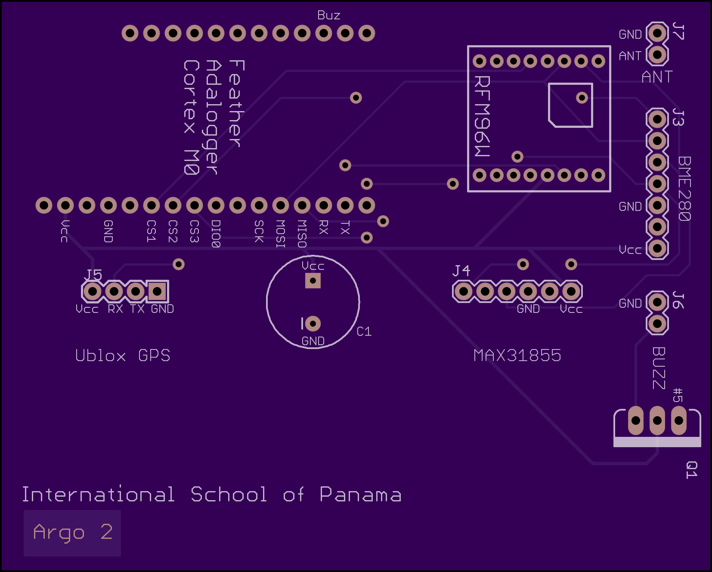

# Argo 2 Tracker

High Altitude Balloon tracker designed for the Argo 2 launch by the Near Space Program at the International School of Panama.

Tracker transmits temperature, pressure and humidity data, as well as location coordinates and other status information.

The GroundStation program shows any data received, along with signal strength and CRC checking. It can also upload new data to the online tracker at [HabHub](https://tracker.habhub.com).

Included are the PCB schematics (made in Eagle CAD) and software of the tracker and receiver, as well as the Ground Station program which runs on the tracking computer.

The software for the tracker and receiver is written in Arduino / C++, with the Ground Station written in Python.


## Table of Contents
 * [Parts and Components](#parts)
 * [Installation](#installation)
 * [Usage](#usage)
 * [Testing](#testing)
 * [Printed Circuit Boards](#pcbs)
 * [Launches](#launch)

<a name="parts"></a>

## Parts and Components
### Tracker:
 * [Adafruit Feather M0](https://www.adafruit.com/product/269), or [Teensy 3.x](https://www.pjrc.com/store/teensy32.html) with [Feather adapter](https://www.adafruit.com/products/3200)
 * U-Blox NEO 6/7/8 Serial GPS module such as [this](https://www.amazon.com/Antenna-AeroQuad-Multirotor-Quadcopter-Aircraft/dp/B00RCP9MLY/)
 * [MAX31855 thermocouple amplifier](https://www.adafruit.com/products/269) (and [thermocouple](https://www.adafruit.com/products/270))
 * [BME280 module](https://www.adafruit.com/products/2652): Pressure, humidity and temperature sensor
 * RFM95W Transceiver

### Receiver:
 * [Adafruit Feather M0](https://www.adafruit.com/product/269)
 * RFM95W Transceiver
 * PCB SMA connector (if using SMA cable for antenna)


<a name="installation"></a>

## Installation
To download the files in this repository run:

`git clone https://github.com/manterolat/argo2-tracker.git`

### Tracker:
#### Software
 * [Arduino IDE](https://www.arduino.cc/en/Main/Software) (1.6.0 and above should work)
 * If using *Teensy 3.x*: Install [Teensyduino](http://www.pjrc.com/teensy/teensyduino.html) (tested with Teensyduino 1.29)
 * If using *Feather M0*: follow [these](https://learn.adafruit.com/adafruit-feather-m0-basic-proto/setup) instructions

#### Arduino Libraries
 * [Adafruit Unified Sensor Driver](https://github.com/adafruit/Adafruit_Sensor)
 * [Adafruit BME280](https://github.com/adafruit/Adafruit_BME280_Library)
 * Only with *Teensy* setup: [Adafruit MAX31855](https://github.com/adafruit/Adafruit-MAX31855-library) (version 1.0.3 or higher for SPI Transactions)
 * [RadioHead](https://github.com/PaulStoffregen/RadioHead) (Paul Stoffregen's version with SPI Transactions)
 * [TinyGPS++](https://github.com/mikalhart/TinyGPSPlus)

### Receiver:
#### Software
 * [Arduino IDE](https://www.arduino.cc/en/Main/Software) (1.6.0 and above should work)

#### Arduino Libraries
 * [RadioHead](https://github.com/PaulStoffregen/RadioHead)

### Ground Station:
GroundStation runs on Python 2.7, and requires the following modules:
 * *crcmod* for CRC checking
 * *pyqrcode* for generating QR codes
 * *pyserial* for serial communication

To install these (using *pip*) run:

`pip install crcmod pyqrcode pyserial`


<a name="usage"></a>

## Usage
After setting up the software and libary requirements you should be able to upload the tracker and receiver programs, as well as run the Ground Station.

### Tracker:
Open `Argo2_Tracker_Feather.ino` or `Argo2_Tracker_Teensy`, depending on your microcontroller, with the Arduino IDE.

Before compiling and uploading to the Feather/Teensy make sure that the CALLSIGN, DEBUG definitions and other settings (such as TX power, frequency, etc.) in the program are set as planned.

Make sure the following lines are correct in the program: 
```C++
#define CALLSIGN "CHANGE_ME"

// Enable/Disable debug messages
#define DEBUG
```

Leaving `#define DEBUG` uncommented will compile the Serial messages, which takes up space and cycles in the microcontroller.

Finally, select the board type and serial port in the Arduino IDE and upload.  

### Receiver:
Open `Argo2_Receiver.ino` with the Arduino IDE, then select the Feather M0 from the boards list and upload.


### Ground Station:
If running on macOS with Python 2 installed manually, double-clicking `GroundStation.py` should start the program.

Otherwise, open a terminal in the argo2-tracker directory and run:

```bash
cd GroundStation
python GroundStation.py
```

The program will keep a log in the form of files: `GroundStation.log` and `sentences.log`.

**Caution: Don't toggle the _Online_ checkbox until you have setup your tracker on [HabHub](https://tracker.habhub.com) and are ready to launch/test.**


<a name="testing"></a>

## Testing
Things to keep in mind before launch:
 * *Cut the thermocouple cable as short as possible* while keeping a small piece outside. We found that this reduced interference and/or resistance in the cable and improved the accuracy of measurements.
 * For the BME280 (pressure and humidity sensor) it's best to use cables and *place the module on the outside of the capsule*.
 * If placing the BME280 outside, *cover the sensor with a small piece of cotton/fabric using tape* in order to block wind which could affect measurements. 

Only the *Adafruit Feather M0* configuration (without thermocouple sensor) has being tested so far. Since then there have been a few changes to the tracker and receiver programs (mostly changing Serial.println to Snprintln).


<a name="pcbs"></a>

## Printed Circuit Boards
Both of these boards can be used with headers (for removable/replaceable components), or with the components soldered directly unto the board. I recommend the first method.

If using headers note that the RFM95W module needs *2.0mm* headers, instead of regular 2.54mm headers.

The PCBs used in the Argo 2 launch were printed by [OSH Park](https://oshpark.com/) and functioned perfectly.

### Tracker:
Note that there is an issue with the buzzer MOSFET and its connections at the moment. If you plan to use this board with a buzzer, you will have to either fix the MOSFET connections or connect the components separately.

 

### Receiver:
This board supports the use of a PCB to SMA adapter if needed.


<a name="launch"></a>

## Launches
We launched the Argo 2 capsule on April 2016 using the Feather M0 setup without the thermocouple (due to SPI issues - fixed in Teensy version). We received data throughout most of flight, which reached over 30 km altitude, and used HabHub to follow the capsule.
Unfortunately, the capsule landed in a mountainous area that made recovery impossible.

A second launch is planned for late November 2016. This time the Teensy setup will be used with the thermocouple enabled.

---

Hardware and software designed by Tomas Manterola.